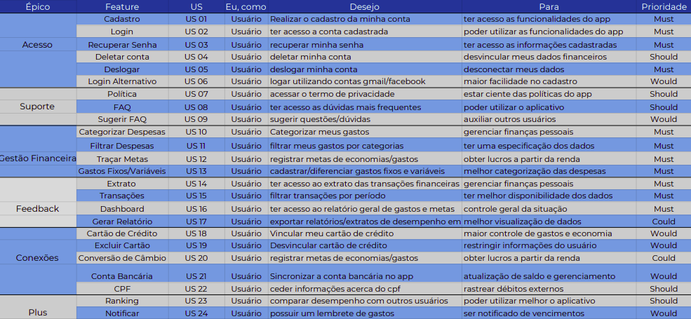

# Backlog do Produto

### Introdução

A técnica do Backlog do Produto é uma lista na qual é reunida os requisitos elicitados e priorizados para construção do Roadmap do Produto. Consiste então, uma lista de funcionalidades desejadas para o produto.

### Metodologia

Para o levantamento dos épicos e features, foram usados documentos anteriores, tais como introspecção, documento de visão e brainstorm.

------------

 

### Referências
>  SERRANO, Maurício; SERRANO, Milene. Requisitos - Aula 15. 1º/2019. 46 slides. Material apresentado para a disciplina de Requisitos de Software no curso de Engenharia de Software da UnB, FGA.

***

### Histórico de revisões
|Data|Versão|Alteração|Autor|
|----|------|---------|-----|
| 30/04/2020 | 0.1 | Criação do documento Backlog do Produto. | Julio Litwin | 
| 02/05/2020 | 0.2 | Formatou o documento e adicionou mais épicos, features e histórias de usuário. | Lucas Gomes | 
|11/04/2020|0.3|Refatorando e adicionando backlog| Bruno Duarte|
