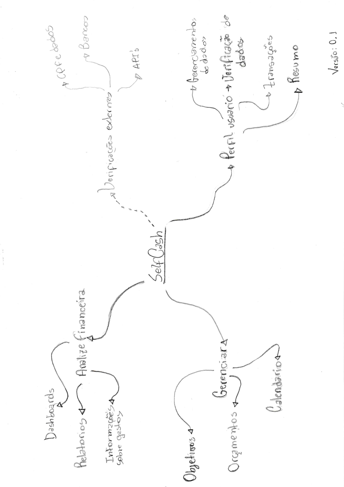

***
# Mapa Mental 
Mapa mental, é o nome dado para um tipo de diagrama, sistematizado pelo psicólogo inglês Tony Buzan, voltado para a gestão de informações, de conhecimento e de capital intelectual; para a compreensão e solução de problemas; na memorização e aprendizado; na criação de manuais, livros e palestras; como ferramenta de brainstorming (tempestade de ideias); e no auxílio da gestão estratégica de uma empresa ou negócio.

Mapas mentais tendem a simplificar um pensamento, uma ideia e encontrar um relacionamento conceitual ideal para representar-las.
***

### [Mapa Mental Selfcash 0.1] 
*Versão: 0.1*  
*Autor:* Davi

 

Neste mapa mental foram adicionadas as relações iniciais pensadas com base em outros aplicativos. O traço na seta à direita foi pensado e adicionado pensando mais em uma área não funcional da aplicação, porém de grande importância para seu funcionamento.

*Nota: Versão feita em folha A4*

***
## Versionamento de edições desta página
***

| Data | Autor | Descrição | Versão |
|------|-------|-----------|--------|
|01/04/2020| Davi Alves| Primeira Versão Mapa Mental| 0.1|

## Referencias
Definindo Escopo em Projetos de Software.São Paulo: Novatec. 2015.   