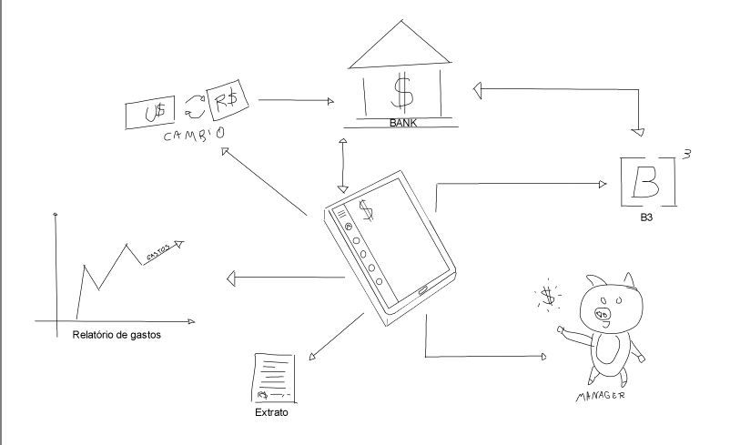

***
# RichPicture
O RichPicture é uma técnica que serve para a obtenção do entendimento de algum sistema em diferentes níveis de objetificação e abstração. Ele é desenvolvido, inicialmente, à mão-livre, podendo ser criado em conjunto com o(s) cliente(s).
***

### [RichPicture Selfcash 0.1] 
*Versão: 0.1*  
*Autor:* Bruno Duarte

 

*Nota: Versão inicial do projeto com uma visão mais rasa das funcionalidades e propriedades da aplicação*

***
## Versionamento de edições desta página
***

| Data | Autor | Descrição | Versão |
|------|-------|-----------|--------|
|01/04/2020| Bruno Duarte| Primeira Versão Rich Picture| 0.1|
|04/04/2020| Bruno Duarte| Retificação  Rich Picture| 0.2|