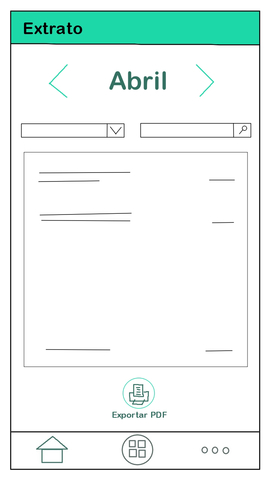
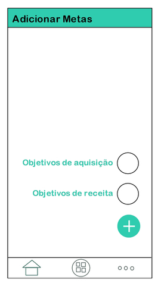
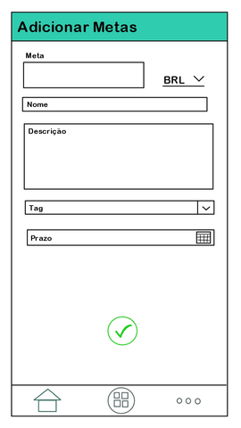
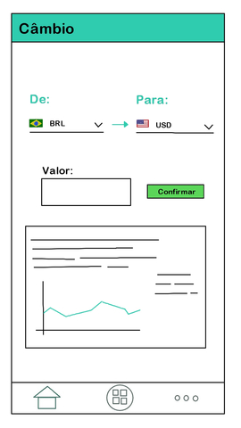

## Protótipo de Baixa Fidelidade
&nbsp;&nbsp;&nbsp;&nbsp;&nbsp;O protótipo de baixa fidelidade busca mostrar mediante sketches uma ideia superficial do aplicativo através de esboços de tela. Busca também demonstrar a idealização da interface e a disposição dos elementos e funcionalidades do projeto.

## Dashboard
&nbsp;&nbsp;&nbsp;&nbsp;&nbsp;Primeiro contato do usuário com o aplicativo 

## Menu
&nbsp;&nbsp;&nbsp;&nbsp;&nbsp;Tela que dispõe as funcionalidades do aplicativo em grade 

## Sobre Nós
&nbsp;&nbsp;&nbsp;&nbsp;&nbsp;Tela que fornece o termo de privacidade e informações internas do projeto 

## Extrato
&nbsp;&nbsp;&nbsp;&nbsp;&nbsp;Tela que exibe informações personalizadas acerca dos dados cadastrados para cada usuário 

## Metas
&nbsp;&nbsp;&nbsp;&nbsp;&nbsp;Visualização das Metas cadastradas e feedback da situação 

## Transação
&nbsp;&nbsp;&nbsp;&nbsp;&nbsp;Registrar informações para gerenciamento financeiro 

## Relatório
&nbsp;&nbsp;&nbsp;&nbsp;&nbsp;Conceder informações gerais acerca dos dados obtidos 

## Indicadores
&nbsp;&nbsp;&nbsp;&nbsp;&nbsp;Feedback dos indicadores de desempenho 

## Cartão de Crédito
&nbsp;&nbsp;&nbsp;&nbsp;&nbsp;Extrai informações do cartão de crédito do usuário e permite uma melhor visualização de suas faturas e gastos 

## Definição do Objetivo
&nbsp;&nbsp;&nbsp;&nbsp;&nbsp;Adicionar informações acerca de um objetivo pessoa a ser alcançado 

## Ranking 
&nbsp;&nbsp;&nbsp;&nbsp;&nbsp;Mostra a produtividade em relação aos demais usuários do aplicativo 

## Câmbio
&nbsp;&nbsp;&nbsp;&nbsp;&nbsp;Calculadora de Conversão da taxa de câmbio 

## Indicadores Financeiros - Gráfico
&nbsp;&nbsp;&nbsp;&nbsp;&nbsp;Gráfico série temporal da inflação pelo patrimônio gerado 

## Conclusão 
&nbsp;&nbsp;&nbsp;&nbsp;&nbsp;No decorrer do projeto esta visão poderá ser alterada devido a atualizações de proposta e complexidade da implementação. Este modelo proposto será discutido e atualizado entre os integrantes do grupo afim de democratizar a idealização do projeto.

***
## Versionamento de edições desta página
***

| Data | Autor | Descrição | Versão |
|------|-------|-----------|--------|
|30/04/2020| Bruno Duarte| Adicionando Protótipo de Papel| 0.1|

